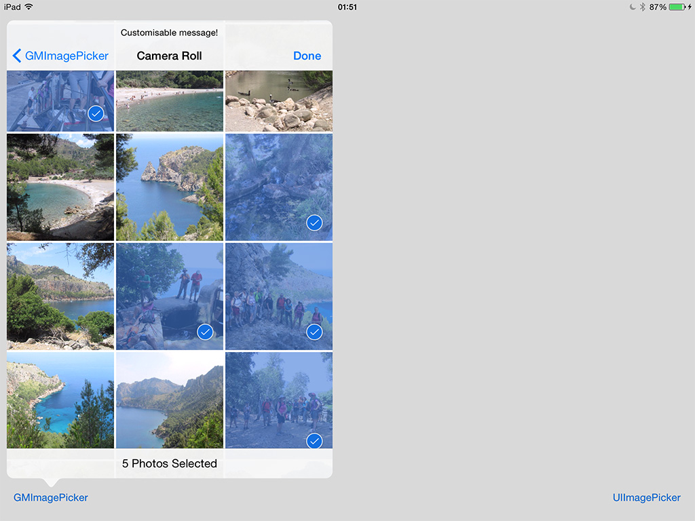

GMImagePicker
=============

An image & video picker supporting multiple selection. Powered by the new iOS 8 **Photo framework**.

### Screenshots

  

### Features
1. Allows selection of multiple photos and videos, even from different albums.
2. Optional bottom toolbar with information about users selection.
3. Works in landscape orientation and allow screen rotation!
4. It can be used as Popover on iPad, with customizable size.
5. Full and customizable acces to smart collections(**Favorites**, **Slo-mo** or **Recently deleted**). 
6. Dynamically sized grid view, easy to customize and fully compatible with iPhone 6/6+ and iPad.
7. Mimics UIImagePickerController in terms of features, appearance and behaviour.
8. Fast & small memory footprint powered by PHCachingImageManager.
9. Full adoption of new iOS8 **PhotoKit**. Returns and array of PHAssets.


## Usage

#### Installation
CocoaPods is coming soon... 
For now, download and import GMImagePicker folder into your project.

#### Import header file

```` objective-c
#import "GMImagePickerController.h"
````
#### Initialize the picker, set the delegate and present it.

```` objective-c
	GMImagePickerController *picker = [[GMImagePickerController alloc] init];
    picker.delegate = self;
    [self presentViewController:picker animated:YES completion:nil];
````

#### Delegate
Implement the `GMImagePickerControllerDelegate` protocol in your class 

```` objective-c
@interface YourViewController : UIViewController <GMImagePickerControllerDelegate>
````
Implement the `didFinishPickingAssets` delegate method. Note you are responsible for dismissing the picker when the operation completes and process the returned `(NSArray *)assetArray` :

```` objective-c
- (void)assetsPickerController:(GMImagePickerController *)picker didFinishPickingAssets:(NSArray *)assetArray
{
    [picker.presentingViewController dismissViewControllerAnimated:YES completion:nil];
    NSLog(@"GMImagePicker: User ended picking assets. Number of selected items is: %lu", (unsigned long)assetArray.count);
}
````

You can also implement optional `assetsPickerControllerDidCancel` 
```` objective-c
-(void)assetsPickerControllerDidCancel:(GMImagePickerController *)picker
{
    NSLog(@"GMImagePicker: User pressed cancel button");
}
````


#### Customization
Before presenting the picker, you can customize some of its properties
```` objective-c
    ...
    //Display or not the selection info Toolbar:
    picker.displaySelectionInfoToolbar = YES;

    //Display or not the number of assets in each album:
    picker.displayAlbumsNumberOfAssets = YES;
   
    //Customize the picker title and prompt (helper message over the title)
    picker.title = @"Custom title";
    picker.customNavigationBarPrompt = @"Custom helper message!";

    //Customize the number of cols depending on orientation and the inter-item spacing
    picker.colsInPortrait = 3;
    picker.colsInLandscape = 5;
    picker.minimumInteritemSpacing = 2.0;

    //You can pick the smart collections you want to show:
    _customSmartCollections = @[@(PHAssetCollectionSubtypeSmartAlbumFavorites),
                                @(PHAssetCollectionSubtypeSmartAlbumRecentlyAdded),
                                @(PHAssetCollectionSubtypeSmartAlbumVideos),
                                @(PHAssetCollectionSubtypeSmartAlbumSlomoVideos),
                                @(PHAssetCollectionSubtypeSmartAlbumTimelapses),
                                @(PHAssetCollectionSubtypeSmartAlbumBursts),
                                @(PHAssetCollectionSubtypeSmartAlbumPanoramas)];
    ...
````


## Use it as popover on iPad
Also works as Popover on the iPad! (with customizable size)



This code works in both iPhone & iPad
```` objective-c
    ...
    GMImagePickerController *picker = [[GMImagePickerController alloc] init];
    picker.delegate = self;
    
    picker.title = @"Custom title";
    picker.customNavigationBarPrompt = @"Custom helper message!";
    picker.colsInPortrait = 3;
    picker.colsInLandscape = 5;
    picker.minimumInteritemSpacing = 2.0;
    picker.modalPresentationStyle = UIModalPresentationPopover;
    
    UIPopoverPresentationController *popPC = picker.popoverPresentationController;
    popPC.permittedArrowDirections = UIPopoverArrowDirectionAny;
    popPC.sourceView = _gmImagePickerButton;
    popPC.sourceRect = _gmImagePickerButton.bounds;
    
    [self showViewController:picker sender:nil];
````


#### Minimum Requirement
Xcode 6 and iOS 8.


### License

The MIT License (MIT)

Copyright (c) 2014 Guillermo Muntaner

Permission is hereby granted, free of charge, to any person obtaining a copy
of this software and associated documentation files (the "Software"), to deal
in the Software without restriction, including without limitation the rights
to use, copy, modify, merge, publish, distribute, sublicense, and/or sell
copies of the Software, and to permit persons to whom the Software is
furnished to do so, subject to the following conditions:

The above copyright notice and this permission notice shall be included in all
copies or substantial portions of the Software.

THE SOFTWARE IS PROVIDED "AS IS", WITHOUT WARRANTY OF ANY KIND, EXPRESS OR
IMPLIED, INCLUDING BUT NOT LIMITED TO THE WARRANTIES OF MERCHANTABILITY,
FITNESS FOR A PARTICULAR PURPOSE AND NONINFRINGEMENT. IN NO EVENT SHALL THE
AUTHORS OR COPYRIGHT HOLDERS BE LIABLE FOR ANY CLAIM, DAMAGES OR OTHER
LIABILITY, WHETHER IN AN ACTION OF CONTRACT, TORT OR OTHERWISE, ARISING FROM,
OUT OF OR IN CONNECTION WITH THE SOFTWARE OR THE USE OR OTHER DEALINGS IN THE
SOFTWARE.


