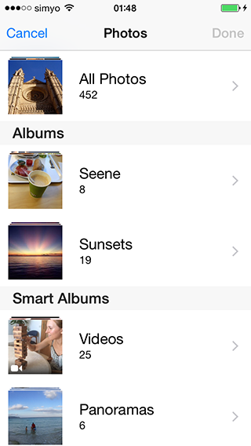

GMImagePicker
=============

An image & video picker supporting multiple selection. Powered by the new iOS 8 **Photo framework**.

  

## Features
1. Allows selection of multiple photos and videos, even from different albums.
2. Full adoption of new iOS8 **PhotoKit**. Returns and array of PHAssets.
3. Mimics UIImagePickerController in terms of featured, appearance and behaviour.
4. Dynamically sized grid view, easy to customize and fully compatible with iPhone 6/6+.
5. Optional bottom toolbar with information about users selection.
6. Filter accesible elements by collections and asset types.
7. Unlimited acces to smart collections, including **Favorites**, **Slo-mo** or **Recently deleted** (not accesible through UIImagePickerController).
8. Fast & small memory footprint powered by PHCachingImageManager.

## Minimum Requirement
Xcode 6 and iOS 8.

## Installation
CocoaPods coming soon...

For now, just download and import GMImagePicker folder into your project.


# Usage

Please refer to the demo app for sample code.

### Import header

Import the header file where you want to present the GMImagePicker.

```` objective-c
#import "GMImagePickerController.h"
````

### Create, customize and present GMImagePicker

Instantiate the picker, set its delegate, customize its interface and present it.

```` objective-c
	//Crete the picker and set delegate
	GMImagePickerController *picker = [[GMImagePickerController alloc] init];
    picker.delegate             = self;

    //Customize UI
    picker.colsInPortrait=3;
    picker.colsInLandscape=5;
    picker.minimumInteritemSpacing=2.0;
    
    //Present the picker controller
    [self presentViewController:picker animated:YES completion:nil];
````

### Implement delegate

Implement the `GMImagePickerControllerDelegate` protocol in your class 

```` objective-c
@interface YourViewController : UIViewController <GMImagePickerControllerDelegate>
````
Now implement `didFinishPickingAssets` delegate method. Note you are responsible for dismissing the picker when the operation completes and process the returned `(NSArray *)assetArray` :

```` objective-c
- (void)assetsPickerController:(GMImagePickerController *)picker didFinishPickingAssets:(NSArray *)assetArray
{
    [picker.presentingViewController dismissViewControllerAnimated:YES completion:nil];
    NSLog(@"GMImagePicker: User ended picking assets. Number of selected items is: %lu", (unsigned long)assetArray.count);
}
````

You can also implement optional `assetsPickerControllerDidCancel` 
```` objective-c
-(void)assetsPickerControllerDidCancel:(GMImagePickerController *)picker
{
    NSLog(@"GMImagePicker: User pressed cancel button");
}
````


## License

The MIT License (MIT)

Copyright (c) 2014 Guillermo Muntaner

Permission is hereby granted, free of charge, to any person obtaining a copy
of this software and associated documentation files (the "Software"), to deal
in the Software without restriction, including without limitation the rights
to use, copy, modify, merge, publish, distribute, sublicense, and/or sell
copies of the Software, and to permit persons to whom the Software is
furnished to do so, subject to the following conditions:

The above copyright notice and this permission notice shall be included in all
copies or substantial portions of the Software.

THE SOFTWARE IS PROVIDED "AS IS", WITHOUT WARRANTY OF ANY KIND, EXPRESS OR
IMPLIED, INCLUDING BUT NOT LIMITED TO THE WARRANTIES OF MERCHANTABILITY,
FITNESS FOR A PARTICULAR PURPOSE AND NONINFRINGEMENT. IN NO EVENT SHALL THE
AUTHORS OR COPYRIGHT HOLDERS BE LIABLE FOR ANY CLAIM, DAMAGES OR OTHER
LIABILITY, WHETHER IN AN ACTION OF CONTRACT, TORT OR OTHERWISE, ARISING FROM,
OUT OF OR IN CONNECTION WITH THE SOFTWARE OR THE USE OR OTHER DEALINGS IN THE
SOFTWARE.


